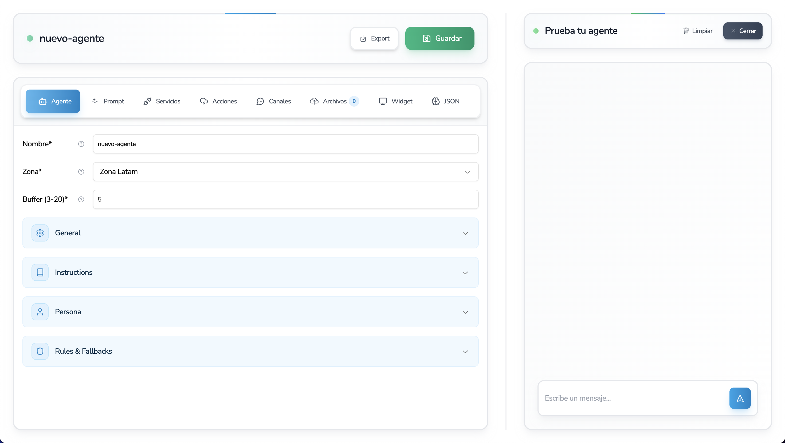

import { Aside, LinkCard } from "@astrojs/starlight/components";

# Concepto

Concepto y tecnología del Agente de IA

## ¿Como funciona el Agente de IA de Wabotify?

Los agentes de Wabotify funcionan por medio de un archivo configurador que es el que se encarga de concentrar toda la información del agente y que el usuario ingresa para que pueda contestar todo lo que el usuario le pida.

El agente de IA funciona solo con cuatro campos principales:

- **Nombre**: El nombre del agente.
- **Prompt**: El prompt del agente.
- **Zone**: La zona del agente.
- **Buffer**: El buffer del agente.

El prompt es el campo más importante, ya que es la información de la cual el Agente se alimenta para poder contestar.

<Aside title="Importante">
  Es importante mencionar que todos los campos de la configuración que no son
  `services`, `channels` y `actions`, es un ordenamiento de información que lo
  guardamos como prompt para el cliente, se puede crear el prompt con todas las
  características sin problemas, pero nuestro archivo configurador es una gran
  ayuda para que pueda tener de forma ordenada el conocimiento de su agente.
</Aside>

## Campos del Agente de IA

Todos los campos del agente de IA se encuentran en el siguiente enlace.

## Campos del Agente de IA

Todos los campos del agente de IA se encuentran en el siguiente enlace.

<LinkCard
  title="Campos del Agente de IA"
  href="/agente-de-ia/campos"
  description="Campos del Configurador de Agentes de IA"
/>

## Consideraciones

- Los Agentes de IA de Wabotify son Portables, esto quiere decir que el archivo JSON que se crea en el agente, puede ser importado a cualquier otro agente de Wabotify, sin perder la configuración.
- Los Agentes de IA de Wabotify tienen que ser creados en la respectiva Zona de la plataforma, en caso el agente se cree en una zona diferente, no funcionará ya que estará buscando en una base de diferente región.
