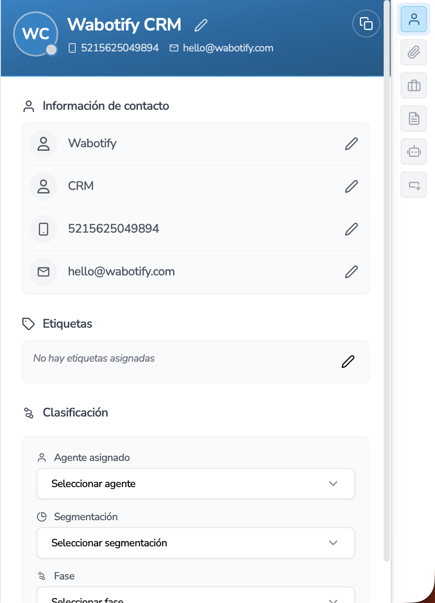

import { Aside } from "@astrojs/starlight/components";

# Chat de Contactos

Funcionamiento de la pantalla de Contactos

Una de las principales características de **Wabotify** es el Chat en Línea, donde se puede tener la centralización de diferentes canales de atención en una misma bandeja de entrada. Los principales canales que se pueden configurar son:

- Whatsapp
- Messenger
- Instagram

La centralización de canales te ayudará a poder tener una visión general de todos los contactos que llegan a tu empresa.

## Agregar Contactos

Los contactos que llegan a la plataforma de los diferentes canales que se puedan configurar, se agregarán de forma automática a la plataforma y se podrá visualizar el mensaje que llega para que pueda ser atendido ya sea por el Agente de IA o el Agente Humano configurado en la plataforma.

También se puede agregar un contacto de forma manual, presionando el botón de Agregar Contacto donde saldrá una pantalla para ingresar la información.

Al momento de Agregar el contacto, puede decidir por qué canal va a agregarlo, ya sea por Whatsapp o por otro Canal. En caso coloque la información de Whatsapp, el sistema le pedirá agregar el número de Whatsapp del contacto de forma obligatoria.

Y si en caso elige otro canal, le pedirá ingresar el correo electrónico del cliente.

<Aside title="Importante">
  Es importante mencionar que los contactos que son creados manualmente, nacen
  sin mensajes en la herramienta, hasta que se le pueda enviar una conversación
  de Whatsapp o que el contacto escriba a la empresa.
</Aside>

## Actualizar Contacto

Para actualizar la información o los atributos del Contacto, se puede ir a la derecha de la pantalla y presionar el icono de la persona, el cual desplegará una pequeña ventana donde podrá modificar la información del contacto.

En esta pantalla podrá actualizar la información que se necesita del contacto.

<Aside title="Atributos">
  Existen cuatro atributos del contacto que serán importantes en todo el
  recorrido de la plataforma y que se podrán ir asignando en los diferentes
  módulos, ya sea de Automatizaciones y de Marketing. Atributos:

    - Etiquetas
    - Agente
    - Segmentación
    - Fases.

  </Aside>

## Adjuntar Archivos

Para poder adjuntar archivos en el contacto se tiene que ir al icono Adjuntar de la derecha y poder realizar las acciones de Agregar Archivo.

Los archivos que se envía el contacto y los agentes dentro del chat, también se podrán visualizar en esta pantalla.

## Historial de Contacto

Dentro de la plataforma cualquier actualización del contacto, se registrará como un movimiento en el Historial y se podrá visualizar, cambios de atributos o comentarios insertados de los agentes.

## Activar / Desactivar Agente de IA

Cuando el Agente de IA está contestando los mensajes de los contactos, el sistema bloqueará cualquier intento de mensaje del agente humano para no confundir al cliente. Para esto el agente humano podrá ver en tiempo real qué es lo que está hablando el Agente de IA.

En caso el Agente Humano decida intervenir la conversación podrá desactivar el Agente de IA en la opción super derecha.

Mientras el Agente con IA está activado, el usuario podrá visualizar esta sección:

En caso contrario se le habilitará la opción para poder escribir al cliente.

