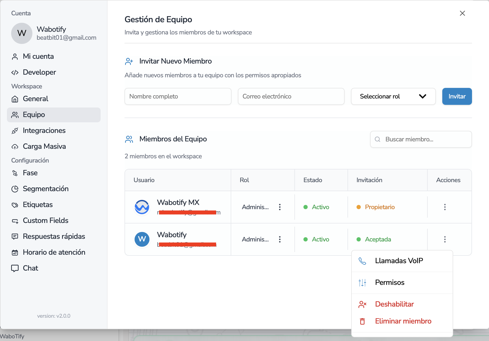
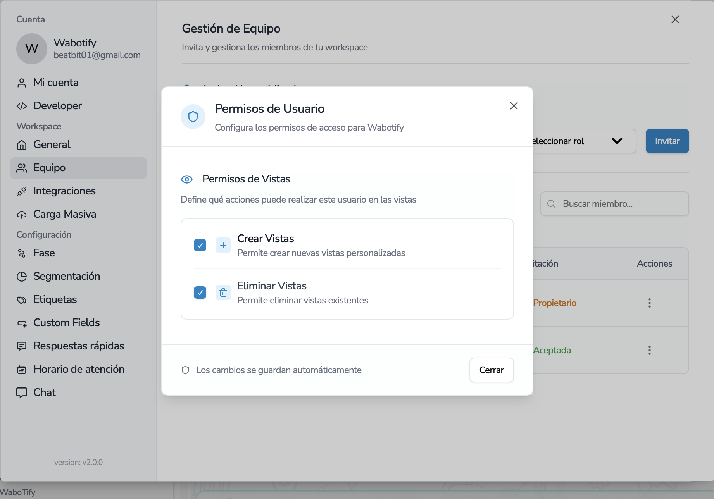

import { Aside } from "@astrojs/starlight/components";

# Seguridad de Usuarios

Configuración de seguridad de usuarios

En la siguiente sección se puede configurar la seguridad de los usuarios de la plataforma, para que solo los usuarios autorizados puedan acceder a las vistas de los contactos.

Para esto existen un conjunto de configuraciones y flexibilidad para que se pueda configurar que es lo que los usuarios pueden ver y hacer en la plataforma.

## Permisos de Acciones en las vistas

en la siguiente pantalla se puede configurar los permisos de las vistas de los contactos. Estos permisos pueden ser Crear la vista y eliminar la vista.

Y luego en la siguiente pantalla poder decidir que acciones puede realizar el usuario en la vista.

## Permisos de Visualizaciones en las vistas

Luego tambien en la pantalla de vistas, cada vez que se crea una vista, se puede configurar quien puede ver la vista y quien no la puede ver.

<Aside title="Nota">
  Recordar que las vistas pueden crearse de forma Privada o Pública, la
  seguirdad es netamente para las vistas privadas. Es importante poder tener el
  control de quien puede crear las vista o eliminar la vista.
</Aside>

La seguridad de las vistas se puede configurar para contactos, tareas y oportunidades. Se puede definir quien puede ver la vista y configurar que solo pueden ver la vista los usuarios que han sido asignados a los contactos.

## Caso Práctico

Si usted tiene un grupo de Agentes que solo podrán ver los contactos que han sido asignados a ellos, se puede configurar de la siguiente manera:

1. Crear una vista privada.
2. Configurar los permisos de las vistas para que solo los usuarios que han sido asignados a los contactos puedan ver la vista.

3. Configurar a estos usuarios para que no puedan crear vistas ni eliminar vistas.

De esta forma solo los agentes que han sido asignados a los contactos podrán ver la vista y no podrán crear ni eliminar vistas y siempre podrán ver solo sus contactos y no de otros agentes.
