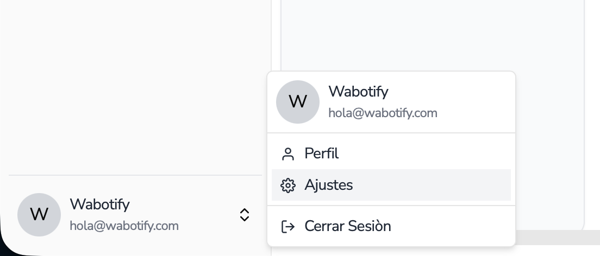
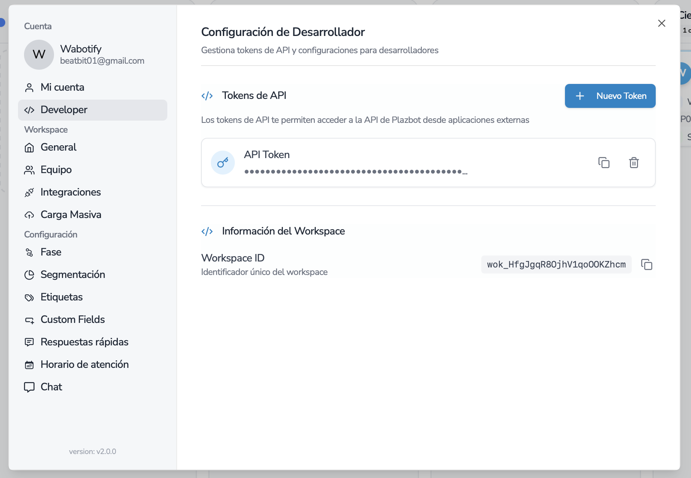

import { Aside } from "@astrojs/starlight/components";

# API Key

Extracción correcta de API Key

## API Key plataforma Plazbot 🤖

Para usar la API de Plazbot, es importante poder generar una nueva clave de usuario dentro de la plataforma. Debemos ir a la sección de configuración:

<Aside title="Importante">
  Las **API Keys** de Wabotify son por cuenta, por lo que una API Key te podrá
  servir para todos los Workspaces que crees.
</Aside>

## Obtener API Key

Para usar la API de Plazbot, es importante poder generar una nueva clave de usuario dentro de la plataforma. Debemos ir a la sección de configuración:

Luego tendrás que ir a la sección de Desarrollador para poder generar una nueva clave.

