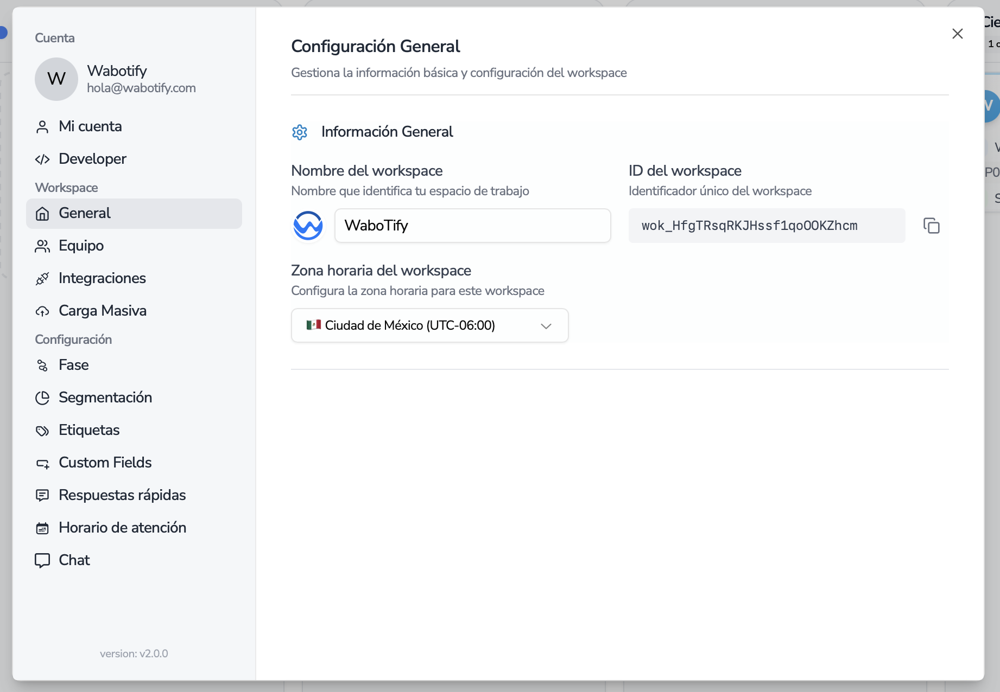

import { Aside } from "@astrojs/starlight/components";

# Workspace ID

Extraer Workspace ID de la plataforma.

## Obtener el ID del Workspace

También es importante obtener el ID del espacio de trabajo, ya que muchos servicios lo solicitan para recuperar datos de la entidad. Para obtenerlo, vaya a la cuenta, luego a la sección General y copie el ID del espacio de trabajo que se muestra.

<Aside type="note" title="Nota">
  El Workspace ID será una de las principales claves para la conexión con el
  API, la deberás usar en todos los servicios.
</Aside>
