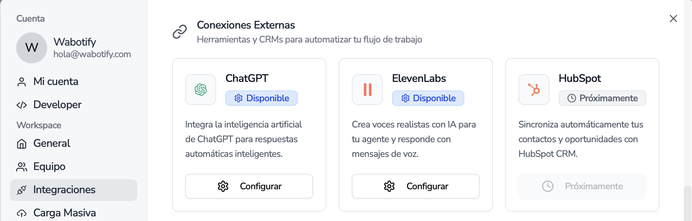

import { Aside } from "@astrojs/starlight/components";

# Conectar ChatGPT

Instrucciones de como conectar ChatGPT a Wabotify

## Conectar con Open AI

Para poder trabajar con la inteligencia artificial de Open AI en la plataforma, se debe de configurar la sección de integraciones para activar la IA que usarán los agentes.

Al momento de configurar ChatGPT, deberá de ingresar la información de una nueva llave de API Key de ChatGPT el cual se debe de extraer de su propia plataforma.

Colocamos el nombre de la Configuración que se usará en la parte de Automatizaciones, luego ingresamos la API Key y seleccionamos el modelo que se usará.

## Extraer API Key de Open AI

Para poder sacar la API Key correcta, debemos de ingresar a la siguiente URL.

Pagina de Open AI [https://auth.openai.com/log-in](https://auth.openai.com/log-in)

<Aside title="Nota">
  En caso de no contar con usuario, se debe de crear un usuario nuevo.
</Aside>

Ingresar a la opción de **Settings**.

Ingresar a la opción API Keys de la sección de la izquierda.

Presionamos el botón de Create **New Secret Key**

Colocamos un nombre a la API Key para poder identificarla, de preferencia con todos los Permissions para no tener inconvenientes en las consultas.

Copiamos la API Key que se nos genera, esta API Key es de una sola vista por lo que si cierra y no copia, deberá de crear otra API Key.

Y luego colocar esta información en la pantalla de Wabotify y grabamos el proceso y deberiamos tener un registro de la siguiente forma.

Con eso concluimos la configuración de ChatGPT.
