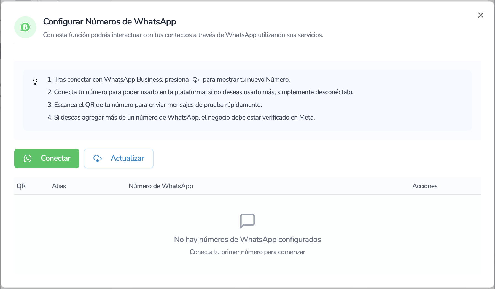
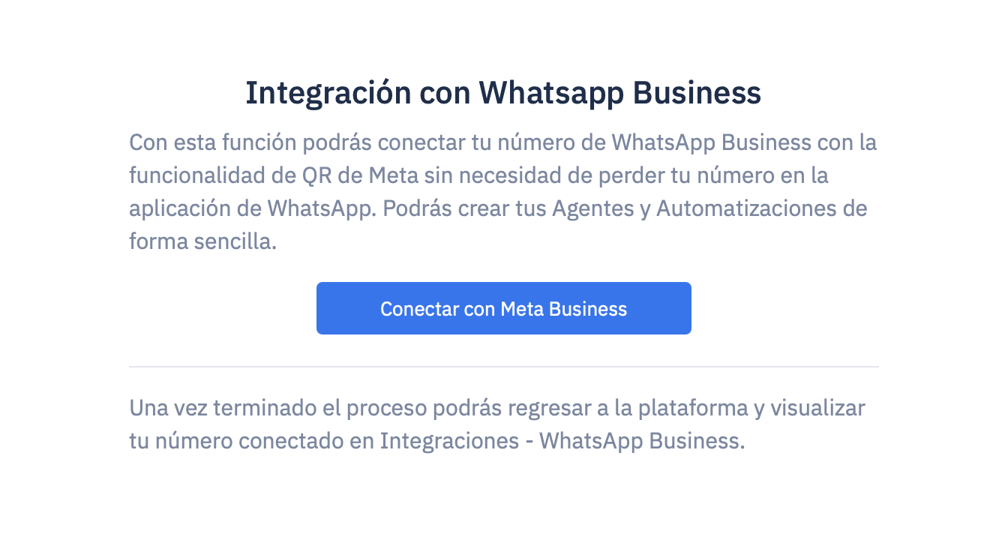
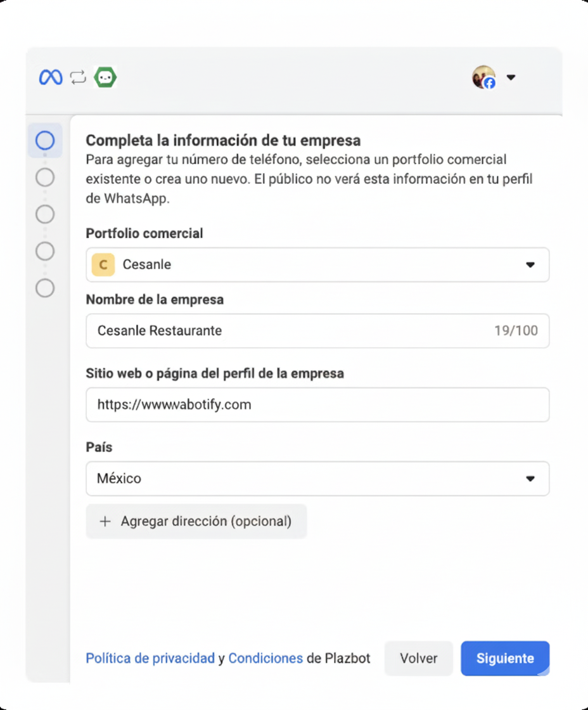
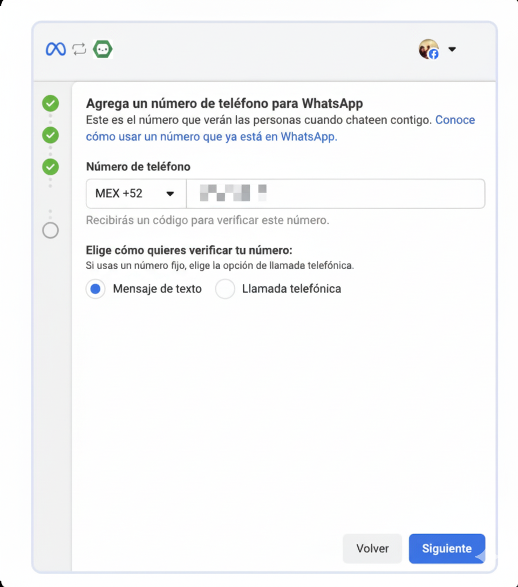
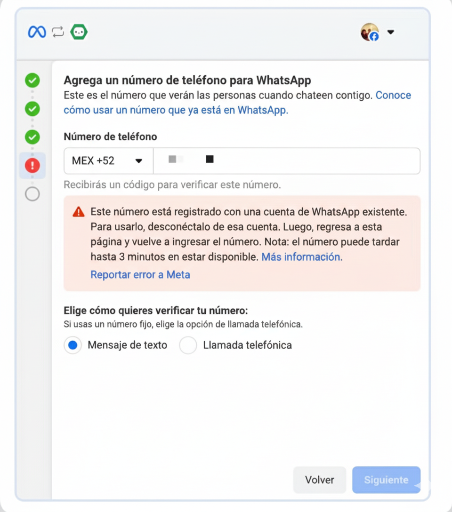
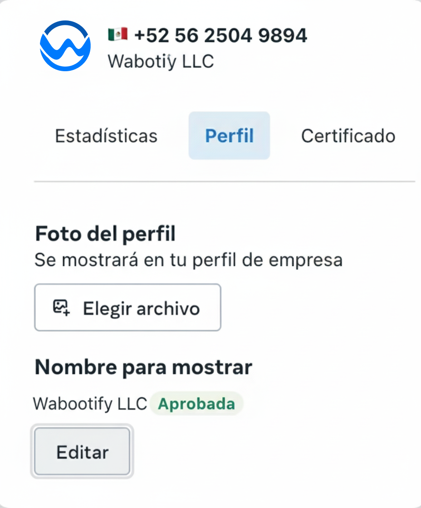

import { Aside } from "@astrojs/starlight/components";

# Conectar WhatsApp API

Instrucciones de cómo conectar el número de WhatsApp a Wabotify

## Configuración de WhatsApp

Para poder conectar el número de WhatsApp a la plataforma es importante poder ir a la configuración del Workspace que se encuentra en la parte inferior izquierda de la pantalla.

**Nombre de Usuario → Cuenta**

Luego ir a la sección de integraciones donde se encontrarán las plataformas que se podrás integrar con la herramienta.

Al momento de presionar el botón de Conectar de WhatsApp, se mostrará un botón de Configurar el cual te llevará a la configurar tus números.

<Aside title="Nota">
  Esta información nos es de gran ayuda para poder conocer a los clientes que se
  registran en nuestra plataforma y poder brindar mejores soluciones y
  servicios.
</Aside>

Cuando presionas el botón Conectar con WhatsApp se abrirá una pantalla externa para seguir con el proceso.

## Conexión con Meta

Cuando presionar el botón **1. Conectar con Meta**, tienes que tener el administrador del Business Facebook de la empresa o si deseas crear un portafolio comercial.

Sigue los pasos que Meta te indicará hasta completar el proceso.

En el punto siguiente puedes trabajar con un portafolio comercial que ya tienes registrado o si deseas puedes crear uno nuevo.

Llenas los datos correspondientes, y colocas el nombre de tu Empresa, es importante que el nombre de tu Empresa también coincida con el nombre que le colocaras al número de tu WhatsApp.

En el siguiente punto tienes que crear una cuenta de WhatsApp Business nueva y un Perfil de WhatsApp Business.

En la siguiente opción escribir el mismo nombre del portafolio comercial.

En el siguiente punto se debe de colocar el número que se usará para la empresa y que se integrará la inteligencia artificial.

<Aside title="Importante">
  **En caso el número se encuentre instalado en otro WhatsApp Personal o
  Business, le saldrá el mensaje de error de Meta.** 👉 Por eso es importante
  que este número sea nuevo o se desinstale de las cuentas de WhatsApp donde
  estaba instalado.
</Aside>

En caso el número este disponible y siga los pasos en la siguiente pantalla le saldrá la opción de colocar el código SMS que le envió al celular. Luego aparecerá una pantalla donde procesará la información y terminará el proceso.

Luego colocar el botón Finalizar y te aparecerá una pequeña pantalla para conectar el número que acabas de registras en Meta y cuando conectes te saldrá una pantalla parecida a esta:

En este momento ya puedes cerrar la pantalla y regresar a la pantalla de Integraciones de Wabotify para que se refleje el número que acabas de conectar.

## Recomendaciones para el Nombre

Es sumamente importante poder tener estas recomendaciones claras al momento de colocar el nombre de WhatsApp ya que es el que aparecerá en los celulares de los clientes.

Meta tiene políticas **estrictas**. Estas son las mejores prácticas para que no te lo rechacen:

### Ejemplo de nombres correctos

### Ejemplo de nombres que pueden ser rechazados

- "Ventas México"
- "Comida Express"
- "🚀 Turbo Market"
- “Nike Online” (si no eres Nike)

<Aside title="Recomendaciones">
  Si la marca que deseas usar no coincide exactamente con el nombre legal,
  puedes subir una página web, redes sociales oficiales o documentación de la
  marca registrada para que Meta lo apruebe.
</Aside>

## Verificación de Aprobación o Rechazo

Cuando regresas a la plataforma debes de seguir los pasos de la pantalla, que es Primero presionar el botón de Descargar el cual hará que aparezca el número de Whatsapp que acabas de conectar.

El número aparecerá como esta pendiente de aprobación con un indicativo amarillo.

Pendiente (Amarillo) Rojo (Rechazado) Verde (Aprobado)

Para esto, la plataforma te entrega una opción al costado de la columna de Número de WhatsApp para que puedas ver la resolución de Meta, si sale aprobado ya puedes usar el número sin problemas.

Para Finalizar, solo colocas **Conectar** para poder usarlo. Esto es ya es parte de la gestión, si deseas conectar o desconectar el número dependiendo de tus necesidades.

## Código QR

La plataforma te da la opción de poder mostrar el código QR de tu número para que puedas enviar mensajes de forma rápida, solo tienes que presionar el botón al costado del Alias el cual te generará un QR.

## Rechazo de Número de WhatsApp

En caso salga **Rechazado** con el indicativo rojo, entonces tiene que visitar la página en Business Meta que lo ayudará a poder encontrar su número que se ha registrado en su portafolio comercial.

Al ingresar al número podrá enviar, presionando el botón **Editar**, de nuevo el nombre a aprobar.

Enviando nuevamente, podrás validar la aprobación en la plataforma con el botón **Refrescar**.

---

<Aside title="Necesitas ayuda">
  En caso tengas alguna duda, te podemos ayudar con nuestro soporte
  support@wabotify.com
</Aside>

## Próximos Pasos

- [Crear Agente de IA](../crear-agente-de-ia) - Configurar tu primer agente inteligente
- [Conectar WhatsApp Business](../conectar-whatsapp-business) - Configuración de WhatsApp Business
- [Crear Automatización](../crear-automatizacion) - Configurar automatizaciones
