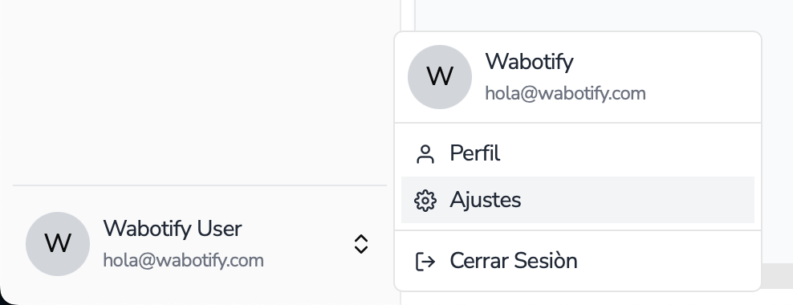
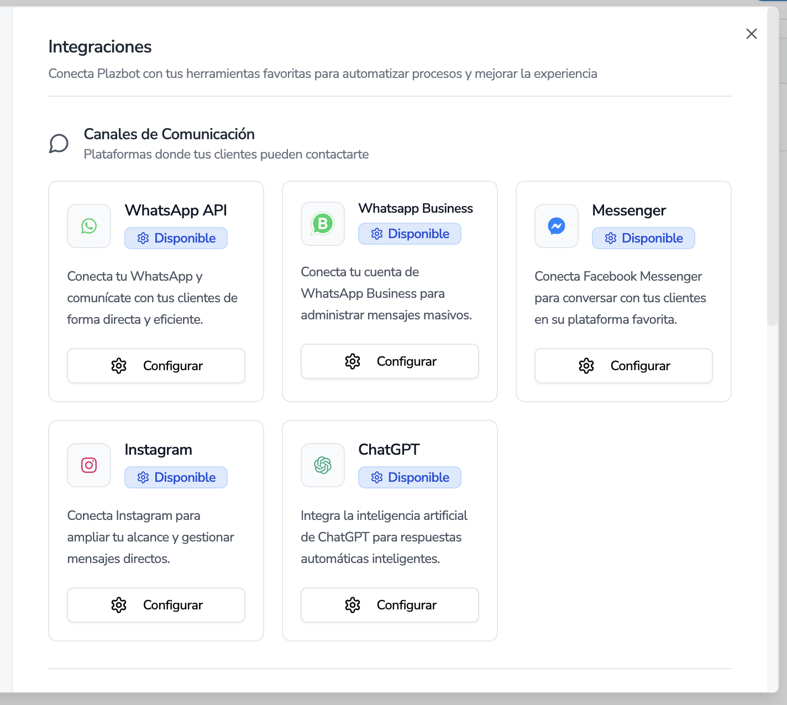
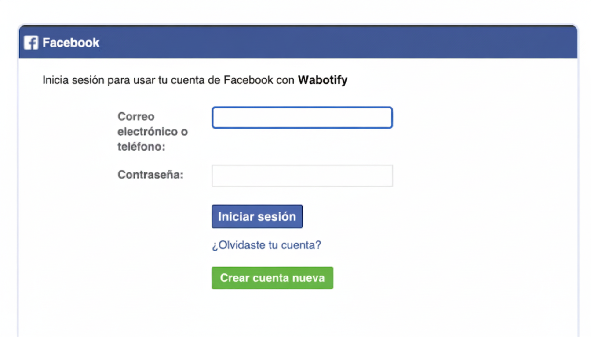
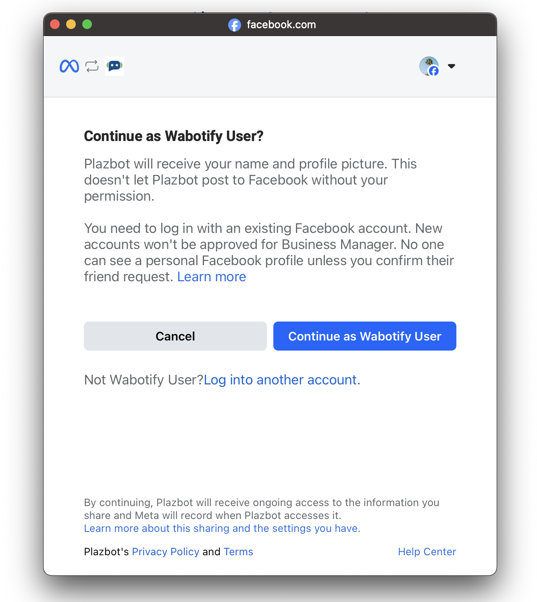
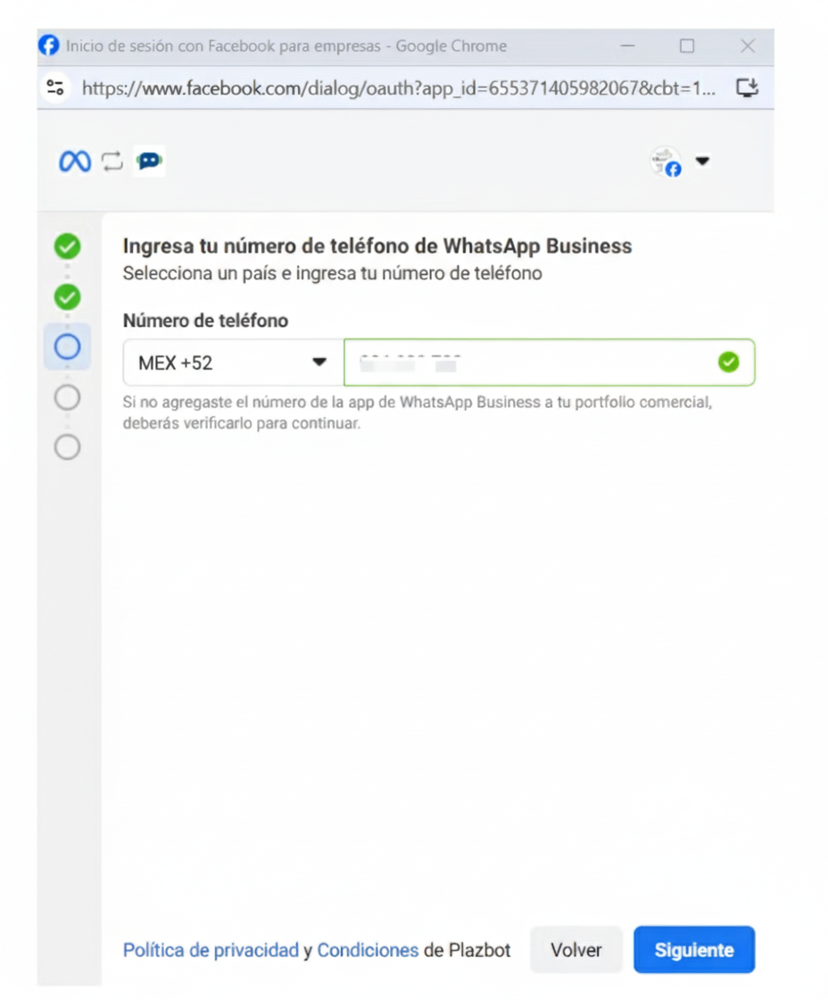
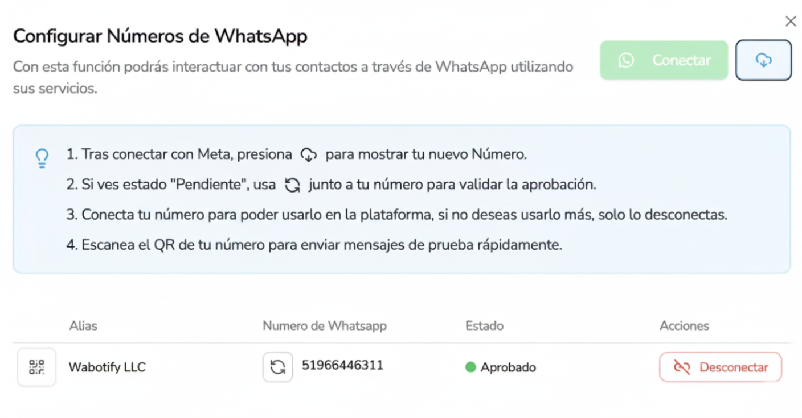

import { Aside } from "@astrojs/starlight/components";

# Conectar Whatsapp Business

Instrucciones de como conectar el número de Whatsapp Business a Wabotify

## Configuración de Whatsapp Business

Para poder conectar el número de Whatsapp Business a la plataforma es importante poder ir a la configuración del Workspace que se encuentra en la parte inferior izquierda de la pantalla.

Nombre de Usuario → Cuenta

Luego ir a la sección de integraciones donde se encontrarán las plataformas que se podrás integrar con la herramienta.

Al momento de presionar el botón de Conectar de Whatsapp Business, se mostrará un botón de Configurar el cual te llevará a la configurar tus números.

Cuando presionas el botón Conectar con Whatsapp se abrirá una pantalla externa para seguir con el proceso.

## Conexión con Meta

Cuando presionar el botón 1. Conectar con Meta, tienes que tener el administrador del Business Facebook de la empresa o si deseas crear un portafolio comercial.

Sigue los pasos que Meta te indicará hasta completar el proceso.

En el punto siguiente puedes trabajar con un portafolio comercial que ya tienes registrado o si deseas puedes crear uno nuevo.

En la siguiente opción podrás decidir si deseas un número nuevo o usar uno existente por medio de la opción de QR que saldrá mas adelante.

En el siguiente punto colocar el número de Whatsapp Business que tienes trabajando con tu empresa.

En la siguiente opción debe escanear el código QR que le sale en la pantalla.

En el número celular del Whatsapp Business va a llegar un mensaje para conectar.

Luego de escanear el código QR, te saldrá una pantalla donde procesará la información y te saldrá para que puedas elegir si deseas compartir tus contactos o no.

Luego el proceso continuará, espera unos minutos para poder conectar el número y finalizar el proceso.

Luego regresarás a la pantalla de Meta donde estas haciendo la configuración y elige la zona horario donde va a trabajar el número de Whatsapp Business.

De ahi sigue el proceso hasta finalizar y que la cuenta termine su configuración.

Cuando termine el proceso, te saldrá una pantalla donde podrás colocar Finalizar y regresar a la plataforma de Wabotify.

<Aside title="Importante">
  Recuerda que trabajar con Whatsapp Business a nivel de cobros es igual como
  trabajar con Whatsapp Business API, donde tienes que agregar tu tarjeta luego
  de los 250 Gratuitos que te da Meta, en tu portafolio comercial.
</Aside>

## Finalización de Conexión

Cuando ya termino la conexion con Meta, el sistema te mostrará el número para que puedas conectar y terminar el proceso.

Luego ya puedes volver a la pantalla de integraciones de Wabotify y colocar el botón Refrescar para que se muestre el número que acabas de conectar y luego el botón Conectar para que puedas usarlo.

## Limitaciones de Whatsapp Business

👉 En resumen: El QR de Meta es útil para acciones simples de marketing (ej: un cartel con "Escanea y escríbenos"), pero no escala:

- Está limitado en volumen de conversaciones (2,000 por número).
- Está limitado en mensaje (140 caracteres).
- No es una solución de automatización empresarial, solo una entrada manual al chat como en el APP pero no se puede hacer envios masivos en Wabotify como con Whatsapp Business API.

No olvides que en caso tengas alguna duda, te podemos ayudar con nuestro soporte support@wabotify.com
