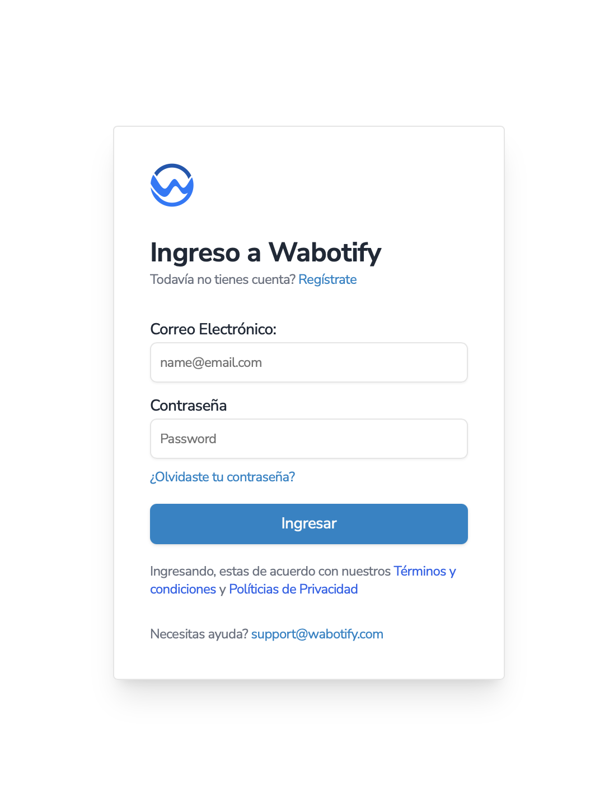

# Creación de Cuenta

Instrucciones de como crear una cuenta en Wabotify

## Crear Cuenta

Para iniciar en **Wabotify** es importante poder registrarse en nuestra página principal. En esta sección debes de ingresar a Crear Cuenta.

Cuando se ingrese en Crear Cuenta, se debe de colocar todos los datos correspondientes.

## Validar Cuenta

Cuando ingrese toda la información correspondiente, el sistema le enviará un correo con un código para validar la existencia del correo electrónico.

## Creación de Workspace

Cuando se haya validado la cuenta con el código, el sistema le pedirá poder crear el primer Workspace de la plataforma.

Luego le pedirá información adicional sobre la cuenta que se esta creando.

✅ Esta información nos es de gran ayuda para poder conocer a los clientes que se registran en nuestra plataforma y poder brindar mejores soluciones y servicios.

Luego la plataforma le pedirá crear agentes adicionales a la cuenta, si desea no es obligatorio hacerlo en ese momento.

Luego se procesará la información y creará el workspace.

El sistema lo llevará a la primera página de la plataforma que es la vista de Contactos, para que pueda configurar su canal de Whatsapp y comenzar a usar la plataforma.

En el siguiente Artículo detallaremos como conectar Whatsapp a la plataforma y luego como crear un Agente de IA de manera muy fácil.

## Próximos Pasos

- [Crear Agente de IA](../crear-agente-ia) - Instrucciones para crear Agentes de IA por la plataforma
- [Conectar Whatsapp API](../conectar-whatsapp-api) - Configuración de WhatsApp API
- [Conectar Whatsapp Business](../conectar-whatsapp-business) - Configuración de WhatsApp Business
