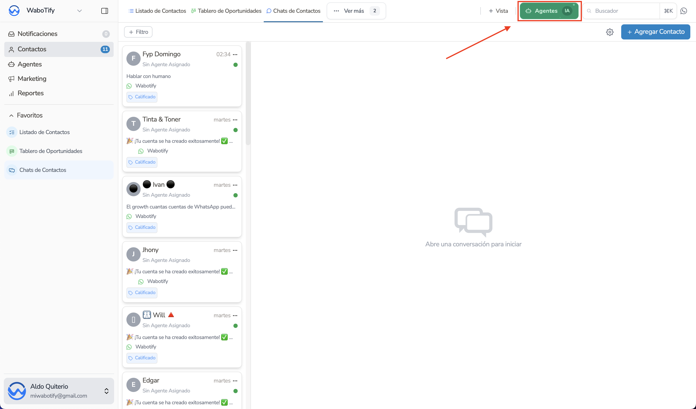
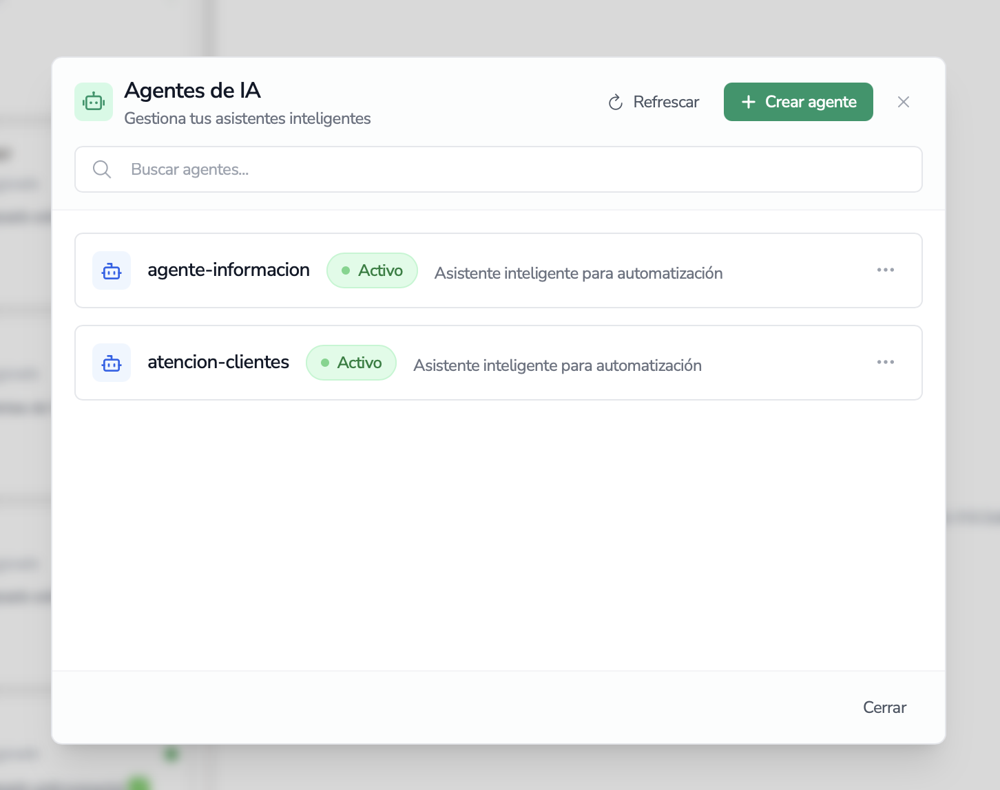
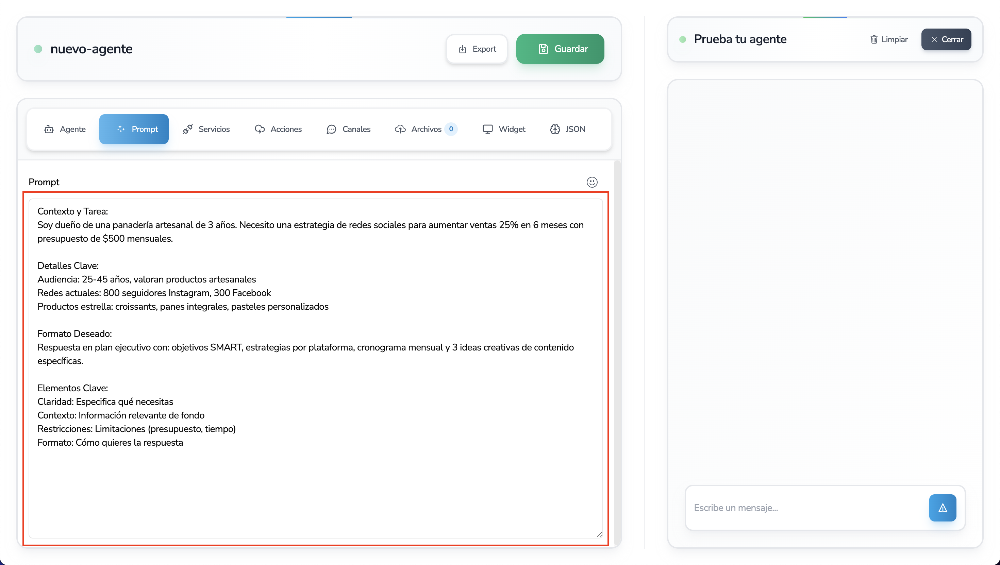
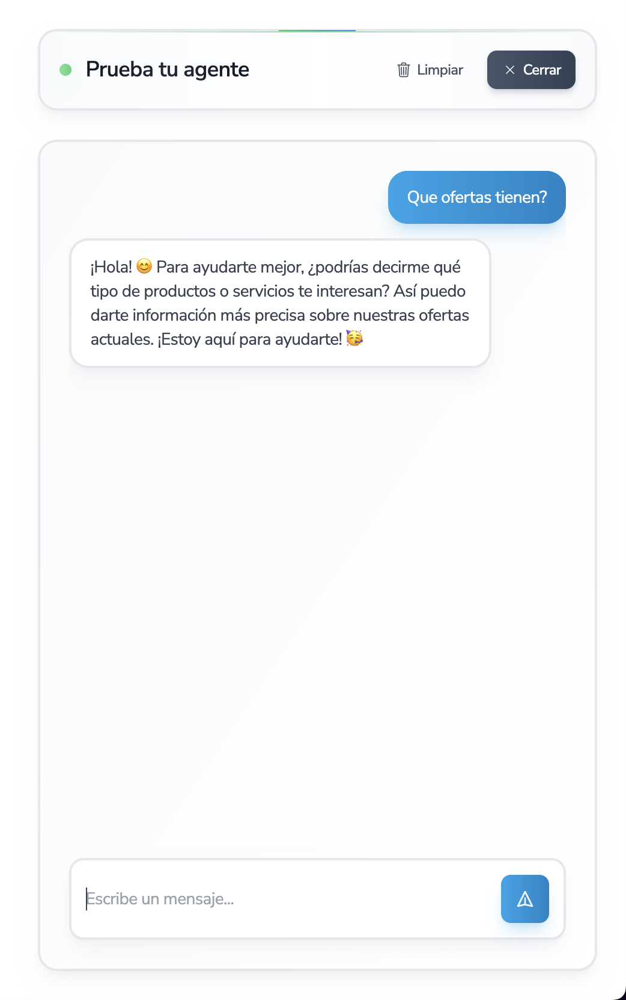
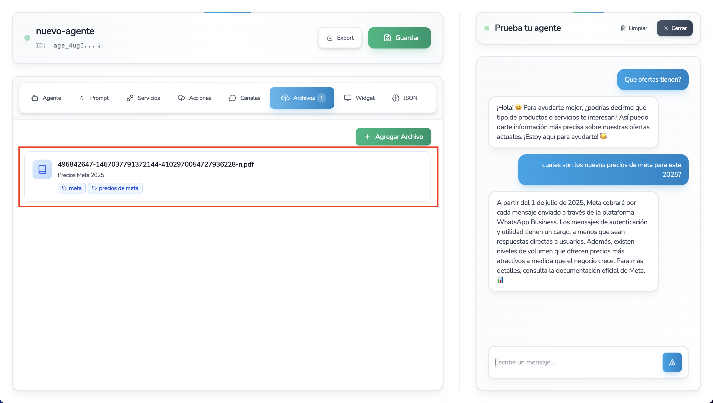
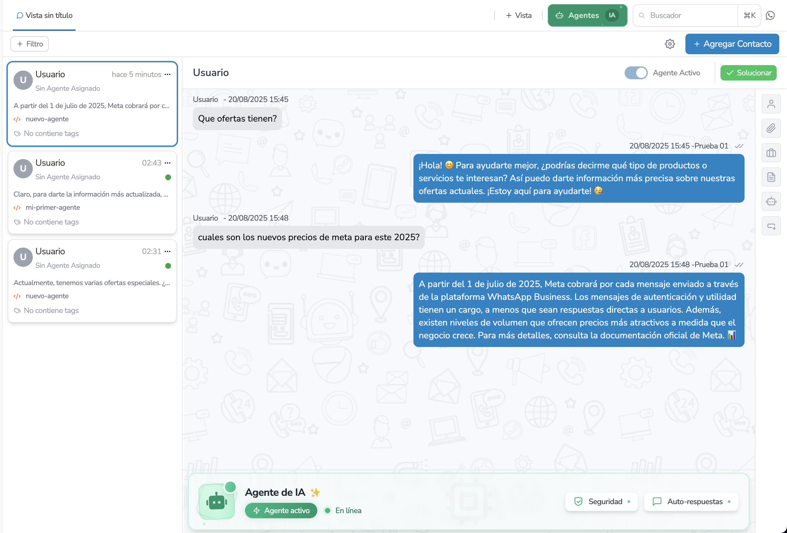
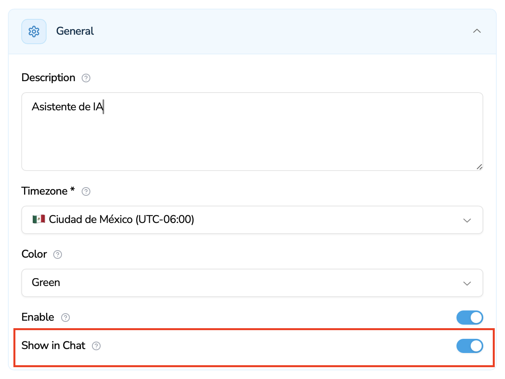
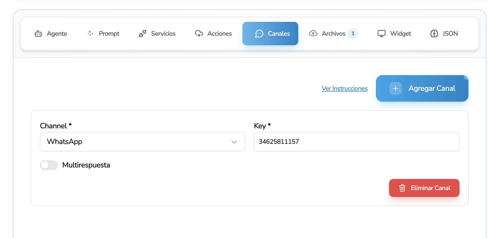

import { Aside } from "@astrojs/starlight/components";

# Crear Agente de IA

Instrucciones para crear Agentes de IA por la plataforma

Para crear tu primer agente en la plataforma, la opción se encuentra en la parte superior derecha de la pantalla de contacto, muy accesible para su creación.

<video
  width="100%"
  height="400px"
  controls
  preload="metadata"
  poster="/videos/thumbnail.webp"
>
  <source src="/videos/create-agent.mp4" type="video/mp4" />
  Tu navegador no soporta la reproducción de videos.
</video>

<Aside title="¿Tienes perfil tecnico?">
  Si tiene un perfil técnico lo invitamos a ver nuestro SDK donde se puede
  realizar estas configuraciones en sus respectivos ambientes.
</Aside>

## Paso 1: Listado del Agente

Al momento de presionar el botón se abrirá un popup para la gestión rápida del agente.

La plataforma le dará la opción de poder crear y configurar un agente de IA por medio de una estructura JSON. Recalcamos que en la plataforma no existe ninguna parte donde se codifica. La estructura JSON es una estructura mundial para poder realizar configuraciones generales rápidas en cualquier ámbito.

La plataforma le mostrará el listado de agentes que tiene la empresa, en caso de no tener ninguno, se mostrará el botón de crear agente.

**Características del Agente**

- Contestar en base a información del Prompt.
- Contestar en base a la configuración general.
- Contestar sobre información de diferentes Archivos PDF y DOCs.
- Contestar sobre información de servicios externos API y recolección de datos.
- Crear Acciones de la plataforma como asignación a agentes, fases, apagar el bot, etc.
- Conectarse con Whatsapp.

## Paso 2: Creación del Agente

Al hacer click en el botón de crear agente, se le mostrará un popup para la creación del agente.

Para poder crear un agente, se debe de tener en cuenta los siguientes campos:

👉 **Nombre**: Es el nombre del Agente para su respectiva identificación, este nombre se mostrará en la lista así como en el listado de Contactos para que puedas saber qué agente está atendiendo a tus clientes.

**Formato del Nombre del Agente:** `nombre-agente-3` (No se permiten espacios ni mayúsculas)

👉 **Prompt**: Es la instrucción general que le vas a dar a tu agente, cómo se comportará y qué necesitas que diga, es la información general para que pueda contestar.

Los límites de un prompt (GPT-4o, que es el modelo que usamos) son aproximadamente 128K tokens (~300 páginas de texto), de igual forma no se recomienda estos límites, en caso se necesite trabajar esta información, le recomendamos colocarlo en un archivo PDF y trabajarlo cargando el archivo, ya que de esa forma extraemos la información de forma vectorial de la base de datos.

👉 **Buffer**: Es la memoria del agente, el Buffer es la capacidad de conversaciones guardadas que puede tener el agente, esto es para que siempre tenga el contexto de la conversación. (Límite: 3 - 20).

👉 **Zone**: Solo valores (`LA`, `EU`) Este campo es sumamente importante, ya que es la zona que se encuentra el agente y la plataforma. En caso se comparta el archivo agent.config.json con alguna otra persona, lo único que debe tener en cuenta es que si la otra persona se encuentra en Europa, entonces el agente lo debe de crear con zone: `EU`

**Estos son los únicos campos necesarios para crear un agente. Luego de esto ya puede probar el agente como responde en nuestro chat de prueba.**

<Aside title="💡">
  Es importante mencionar que todos los campos de la configuración que no son
  `services` o `channels`, es un ordenamiento de información que lo guardamos
  como prompt para el cliente, se puede crear el prompt con todas las
  características sin problemas, pero nuestro archivo configurador es una gran
  ayuda para que pueda tener de forma ordenada el conocimiento de su agente.
</Aside>

## Paso 3: Probar el Agente

Una vez creado el agente, se puede probar en el chat de prueba, para ello se debe de hacer click en el botón de probar.

Puedes realizar las preguntas que desees y el agente responderá de acuerdo a la configuración que le has dado.

## Paso 4: Agregar Archivos al Agente (Opcional)

Para poder agregar archivos al agente, se debe de hacer click en el botón de agregar archivo.

## Paso 5: Visualización en el Chat en línea

Una vez creado el agente, se puede visualizar en el chat en línea.

Para poder visualizar el agente en el chat en línea, se debe de hacer click en el check de `showInChat` y luego hacer click en el botón de guardar.

## Paso 6: Conectar con Whatsapp

Para poder conectar con whatsapp, se debe de hacer clic en la opción de Channel y colocar el número de teléfono del Whatsapp configurado.

<Aside title="Configuración de WhatsApp">
  Tienes que tener configurado el número de teléfono en el panel de whatsapp,
  para poder conectar con el agente.
</Aside>

**Documentación relacionada:** [Configurar WhatsApp](../conectar-whatsapp-api)

## Próximos Pasos

- [Conectar WhatsApp API](../conectar-whatsapp-api) - Instrucciones de cómo conectar el número de WhatsApp
- [Conectar WhatsApp Business](../conectar-whatsapp-business) - Configuración de WhatsApp Business
- [Conectar ChatGPT](../conectar-chatgpt) - Integración con ChatGPT
- [Crear Automatización](../crear-automatizacion) - Configurar automatizaciones
