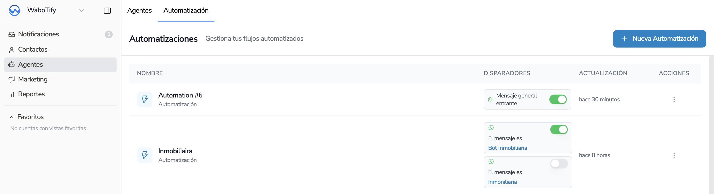
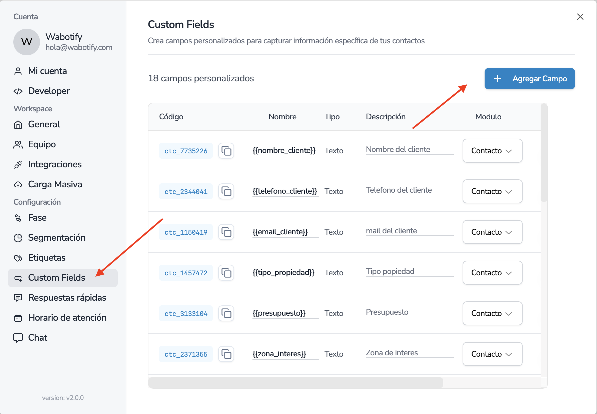

import { Aside } from "@astrojs/starlight/components";

# Crear Automatización

Instrucciones para crear Automatización básica con Agente de IA

Para crear tu primer agente en la plataforma debemos de ir a la opción de Automatizaciones.

Y colocamos la opción de Agregar Automatización. En esta opción se insertará un registro nuevo donde debemos de ingresar.

Para poder tener un Agente totalmente funcional, solo se necesita tres nodos en la automatización que pasamos a explicar.

## Paso 1: Disparador

Este es el primer nodo el cual se configura la recepción del mensaje de Whatsapp y colocaremos la opción que llegue siempre el mensaje.

Presionamos el Botón **Agregar Disparador**. Y en la siguiente opción colocamos Usuario envía mensaje directo.

Y listo ya esta configurado el primer nodo.

## Paso 2: Agente de IA

Luego cerramos y escogemos la opción de Agente IA.

Nos saldrá la siguiente pantalla para poder configurar.

<Aside title="Importante">
  Antes de continuar es importante que pueda crear una variable personalizada,
  el cual almacenará la respuesta de la IA y que podrá usar en los diferentes
  nodos de la automatización.
</Aside>

Para eso nos vamos a la opción de Ajustes y elegimos la opción Variables.

Al momento de Agregar la Variable, colocamos su nombre, descripción y el tipo de Variable y ponemos Crear Variable.

<Aside title="Importante">
  Si es necesario refrescamos la pantalla para que puedan aparecer esas
  variables dentro de la automatización.
</Aside>

Regresando a la pantalla de Automatizaciones, podemos comenzar a crear nuestro Prompt para nuestro Agente. Recordar que el Prompt ayudará a decirle todas las instrucciones que necesita el Agente para poder contestar toda la información de la empresa.

Existe la opción de Abrir Editor, el cual te ayudará a poder tener una idea clara de como entrenar a tu Agente de IA.

Al guardar el Prompt, regresarás a la opción y tienes que configurar las siguientes opciones.

La primera opción es donde colocarás la variable que creamos antes y es donde se guardará la información de la respuesta de la IA.

La siguiente opción es la memoria de la IA, el cual sirve para saber cuantos contextos de conversaciones idea y vuelta podrá recordar la IA cuando converse con tus clientes, esto te ayudará a que la IA siempre tenga un hilo de conversación y evitar que salude, en varias ocasiones o preguntar lo mismo. En esta opción tu decides cuanto colocar.

**Cantidad Recomendada: 10**.

Y por ultimo colocar la API Key de Open AI que se creo antes en la sección de integraciones.

## Paso 3: Respuesta del cliente

Luego de configurar, lo único que falta es enviar la respuesta al cliente y esta acción es tan sencilla como agregar un nodo Enviar Mensaje.

Al agregar el nodo, nos sale la pantalla de:

En esta opción debemos de buscar la variable donde guardamos la respuesta de IA y colocarlo en el mensaje. Para eso presionamos el botón de Variables disponibles y nos mostrará todas las variables.

Buscamos nuestra Variable que guardamos de la IA y copiamos y lo colocamos dentro del mensaje. Nos quedaría algo como la imagen.

Y lo último que faltaría sería unir los nodos y eso se hace jalando desde un punto al otro nodo.

Y listo, te queda escribir a tu Whatsapp y ver como contesta tu Agente de IA y si deseas entras a ajustar el Prompt con la información que necesitas

## Paso 4: Apagar el Agente de IA

En caso por algún motivo desean apagar el Agente de IA, lo único que tienen que hacer, es ir a la opción del Nodo disparador y apagar la opción.

