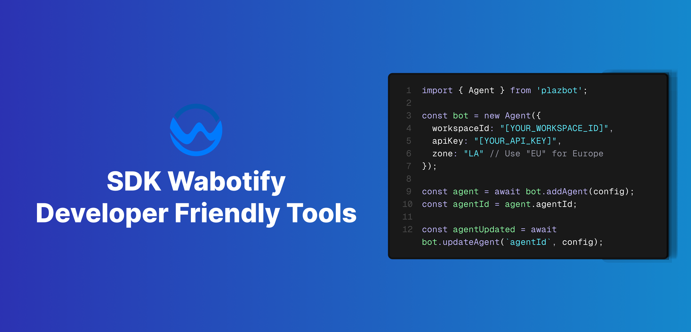

import { LinkCard, CardGrid } from "@astrojs/starlight/components";

# Bienvenidos al SDK

Contruye tus agentes de IA con solo unas líneas de código

## Alcance del SDK

**Wabotify** como plataforma tiene como unidad base el Agente de IA, donde se puede crear un Agente de forma muy facil y poder desplegarlo en donde se necesite, puede ser Whatsapp, Portal IA, Widget o cualquier software que puedan tener en las empresas o participar de cualquier integración.

Con **Wabotify SDK**, vas a poder contestar todas las preguntas de tus clientes, ya que nuestra tecnología RAG hace que podamos leer cualquier archivo que adjuntes al agente asi como cualquier servicio API Rest.

<CardGrid>
  <LinkCard
    title="Credenciales"
    href="/developer-hub/api-key"
    description="Get your docs set up locally for easy development."
  />
  <LinkCard
    title="Agentes IA"
    href="/sdk/agentes-ia"
    description="Preview your changes before you push to make sure they’re perfect"
  />
  <LinkCard
    title="Portal"
    href="/sdk/portal"
    description="Customize your docs to your company’s colors and brands"
  />
  <LinkCard
    title="Mensjaes de WhatsApp"
    href="/sdk/whatsapp/"
    description="Automatically generate endpoints from an OpenAPI spec"
  />
</CardGrid>
